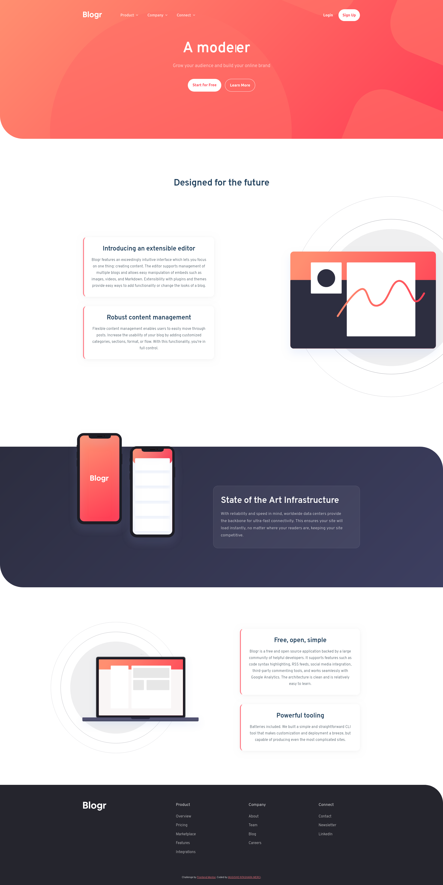
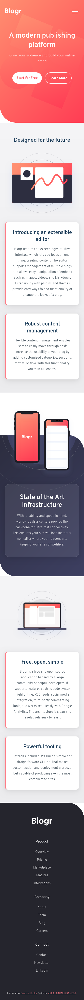

# Frontend Mentor - Blogr landing page solution

This is a solution to the [Blogr landing page challenge on Frontend Mentor](https://www.frontendmentor.io/challenges/blogr-landing-page-EX2RLAApP). This project has been refined to achieve a pixel-perfect, professional SaaS-style landing page with premium animations and a robust responsive structure.

## Table of contents

- [Frontend Mentor - Blogr landing page solution](#frontend-mentor---blogr-landing-page-solution)
  - [Table of contents](#table-of-contents)
  - [Overview](#overview)
    - [The challenge](#the-challenge)
    - [Screenshots](#screenshots)
      - [Desktop Result](#desktop-result)
      - [Mobile Result](#mobile-result)
    - [Links](#links)
  - [My process](#my-process)
    - [Built with](#built-with)
    - [Key Features](#key-features)
    - [What I learned](#what-i-learned)
  - [Author](#author)

## Overview

### The challenge

Users should be able to:

- View the optimal layout for the site depending on their device's screen size.
- See hover states for all interactive elements on the page.
- Experience smooth scroll-reveal animations for all major sections.
- Interact with a dynamic mobile menu and multi-level dropdowns on desktop.

### Screenshots

#### Desktop Result



#### Mobile Result



### Links

- Solution URL: [GitHub Repository](https://github.com/FreeDev-Group/Blogr-Landin-page-by-Dieu-merci)
- Live Site URL: [Live Demo](https://freedev-group.github.io/Blogr-Landin-page-by-Dieu-merci/)

## My process

### Built with

- **Semantic HTML5** markup for SEO and Accessibility.
- **CSS Custom Properties** (Variables) for a maintainable design system.
- **Flexbox & CSS Grid** for robust and stable layouts.
- **Mobile-first workflow** ensuring a seamless experience on all devices.
- **Vanilla JavaScript (ES6+)** for all interactive logic.
- **Intersection Observer API** for performance-optimized scroll reveal animations.

### Key Features

1. **Premium Typewriter Effect**: A custom JavaScript-driven typing animation for the Hero title that mimics a real-time publishing platform experience.
2. **Glassmorphism SaaS Cards**: Re-imagined feature sections with frosted glass backgrounds, subtle borders, and layered box-shadows that react to user interaction (hover lift effects).
3. **Fixed Glass Navbar**: A responsive navigation bar that switches to a blurred glassmorphism state upon scrolling, maintaining accessibility while scrolling.
4. **Staggered Animations**: Content blocks reveal themselves with timed delays, creating a sophisticated "Premium SaaS" entry feel.
5. **Robust Desktop Illustrations**: Solved complex CSS issues involving bleeding SVG illustrations that overflow the container without breaking the layout or causing horizontal scroll.

### What I learned

Working on this project reinforced the importance of **Structural Stability (CLK prevention)**. Moving away from fragile absolute positioning to a Flexbox-based system solved persistent layout collisions on desktop.

I also mastered the **Intersection Observer API** to trigger animations only when elements are in view, which is significantly more performance-oriented than traditional scroll listeners.

```js
// Performance-optimized Scroll Reveal
const revealObserver = new IntersectionObserver(
  (entries) => {
    entries.forEach((entry) => {
      if (entry.isIntersecting) {
        entry.target.classList.add("reveal--active");
        revealObserver.unobserve(entry.target);
      }
    });
  },
  { threshold: 0.15 },
);
```

## Author

- GitHub - [Dieu-merci](https://github.com/ir-mugisho-merci)
- Frontend Mentor - [@ir-mugisho-merci](https://www.frontendmentor.io/profile/ir-mugisho-merci)
